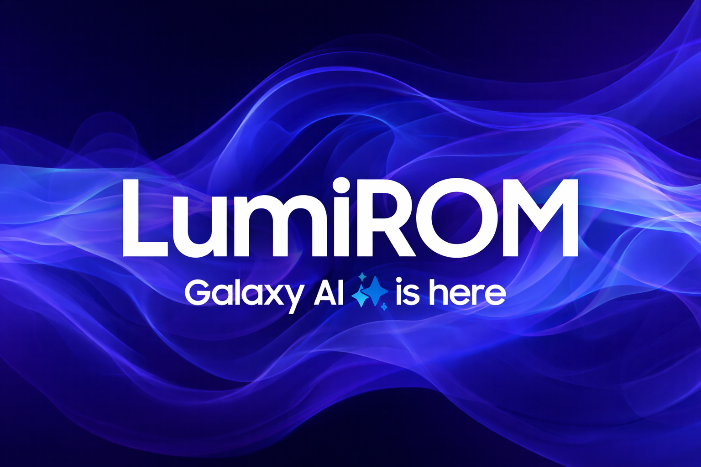

**ROM Feature:**

\- Heavily debloated for smooth use.

\- Bypassed screenshot detection.

\- Secure folder support.

\- With Galaxy AI.

\- And much more!

## Licensing
This project is licensed under the **MIT License** - see the [LICENSE](LICENSE) file for details.
- **[android-tools](https://github.com/nmeum/android-tools)** - Licensed under Apache License 2.0
- **[apktool](https://github.com/iBotPeaches/Apktool)** - Licensed under Apache License 2.0  
- **[erofs-utils](https://github.com/sekaiacg/erofs-utils)** - Dual licensed (GPL-2.0, Apache-2.0)
- **[platform_build](https://android.googlesource.com/platform/build)** - Licensed under Apache License 2.0
- **[e2fsprogs](https://github.com/tytso/e2fsprogs)** - Licensed under GPL-2.0 / LGPL-2.1
## 

**For get latest OneUi roms check:**

**LumiROM Channel:** https://t.me/LumiROMs

**LumiROM Group:** https://t.me/lumiromgroup

## 

Also thanks to Al Noman for the script 